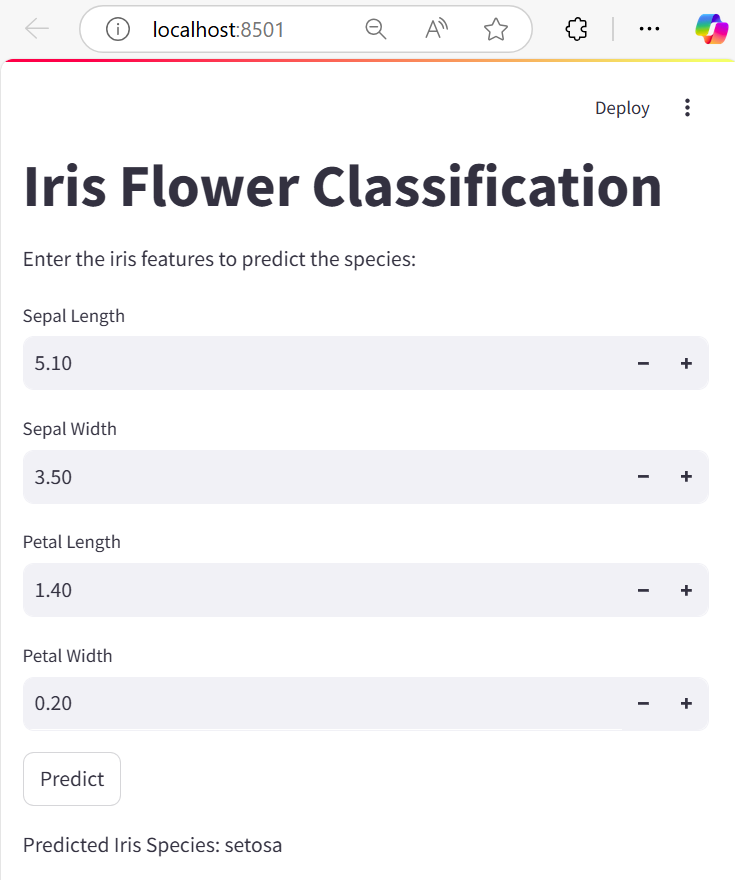

# Iris Classification Pipeline, Streamlit App & FastAPI

This project demonstrates an end-to-end machine learning pipeline using the Iris dataset. It includes:
- A training script that builds an automated ML pipeline (with preprocessing, model training, evaluation, and saving).
- A Streamlit web application for model inference via a graphical interface.
- A FastAPI application to serve model predictions via REST API endpoints.
- A batch file that reads a `.env` file to initialize your virtual environment.

## Project Structure

```
├── app.py             # Streamlit app for model inference
├── api.py             # FastAPI app for serving predictions via REST API
├── train_model.py     # Script to build, train, and save the ML pipeline
├── iris_pipeline.pkl  # Saved model pipeline (generated by train_model.py)
├── .env               # Environment variable file containing VENV path (to be created)
├── init_venv.bat      # Batch file to initialize the virtual environment
├── requirements.txt   # Python dependencies
└── README.md          # This file
```

## Prerequisites

- **Python 3.6+**
- **pip** (Python package installer)
- **Windows OS** (for the provided batch file)

## Setup & Operation Order

### 1. Clone the Repository

Clone this repository and navigate into its directory:

```bash
git clone https://github.com/mohiteamit/simple_pipeline_using_iris.git
cd simple_pipeline_using_iris
```

### 2. Create the `.env` File

Create a file named `.env` in the project root with the following content.  
Make sure to replace `<path-to-your-virtual-environment>` with the actual path to your virtual environment's activation script:

```dotenv
VENV=<path-to-your-virtual-environment>\Scripts\Activate
```

### 3. Create/Activate the Virtual Environment

You have two options:

#### Option A: Using the Provided Batch File

1. With the `.env` file in place, run the batch file to initialize your virtual environment:

   ```batch
   init_venv.bat
   ```

#### Option B: Manually Activating Your Virtual Environment

If you prefer manual activation, run:

```batch
<path-to-your-virtual-environment>\Scripts\Activate
```

### 4. Install Dependencies

Once your virtual environment is active, install the required packages using `requirements.txt`:

```bash
pip install -r requirements.txt
```

### 5. Train the Model

Run the training script to load the Iris dataset, preprocess the data, train a RandomForest classifier (within a pipeline), evaluate its performance, and save the pipeline to disk:

```bash
python train_model.py
```

After running the script, a file named `iris_pipeline.pkl` will be generated.

### 6. Run the Streamlit App

Launch the Streamlit app to interact with the model via a graphical web interface:

```bash
streamlit run app.py
```

In your web browser, you can:
- Input iris feature values (sepal length, sepal width, petal length, petal width)
- Click the **Predict** button to view the predicted iris species

### 7. Run the FastAPI App

To serve predictions via a REST API, launch the FastAPI server with:

```bash
uvicorn api:app --reload
```

By default, the server will start at `http://127.0.0.1:8000`. You can access the interactive API documentation at `http://127.0.0.1:8000/docs` to test the `/predict` endpoint.

## Additional Notes

- **Automated Retraining:**  
  You may schedule the training script using tools like cron jobs, Windows Task Scheduler, or advanced scheduling tools such as Airflow if needed.

- **Modularity:**  
  The training and inference stages are separated. You can update the model by re-running `train_model.py` without affecting the Streamlit or FastAPI interfaces.

- **Customization:**  
  Feel free to extend the pipeline (e.g., add more preprocessing steps) or enhance the Streamlit app and FastAPI endpoints (e.g., add logging, error handling, or additional visualizations).

## App screenshot


## Contributing

Contributions and improvements are welcome. Please open an issue or submit a pull request for any suggestions or enhancements.

## License

This project is licensed under the MIT License.

## Contact

For questions or further information, please reach out to [mohite.amit@gmail.com].
